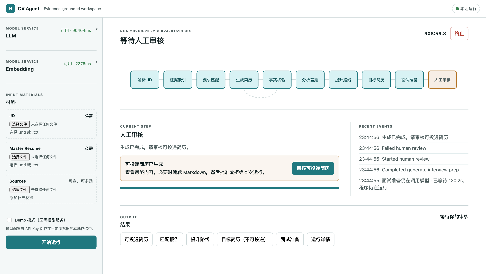

# CV Agent

CV Agent 是一个本地运行、证据驱动的求职简历 Agent。它根据职位描述（JD）、主简历和可选的补充材料，生成当前真实经历能够支持的最佳可投递简历，并给出补齐能力差距的具体路径。

它的核心原则是：**不编造经历，不把目标能力伪装成已有能力。** 每项可投递内容都必须能追溯到用户提供的事实证据。



## 核心能力

- **解析岗位要求**：提取 JD 中的职责、技能、经验与优先级。
- **匹配履历证据**：从主简历和补充材料中检索证据，区分强匹配、部分匹配、可迁移能力和缺失项。
- **生成可投递简历**：在事实边界内保留、排序、精简或改写已有经历，不用模型虚构内容填补空白。
- **分析差距与规划提升**：针对重要缺口生成有范围、有验收证据的学习或作品集任务。
- **生成目标简历**：当存在重要能力差距时，提供明确标注为目标状态的未来版本，帮助理解提升方向，但不能直接投递。
- **准备面试**：基于已有履历证据整理回答思路，并提供诚实解释能力缺口的方法。
- **人工审核与过程追踪**：展示 Graph 执行步骤、耗时和事件；最终可投递简历必须经过人工审核。

## 生成内容

一次运行可能生成以下文件：

| 文件 | 说明 |
| --- | --- |
| `application-resume.md` | 已经过事实核验、可进入人工审核并用于投递的简历。 |
| `match-report.md` | JD 要求与履历证据的匹配报告。 |
| `growth-plan.md` | 针对重要差距的学习、实践或作品集提升路线。 |
| `target-resume.md` | 仅在存在重要能力差距时生成的目标版本；不可审核、不可直接投递。 |
| `interview-prep.md` | 基于证据的面试回答准备与缺口应对建议。 |
| `run.json` | 检索、上下文、路由和执行过程的审计信息。 |

事实安全检查失败时，还可能生成 `failure-report.md` 和 `unsafe-draft.md` 供诊断；这些文件不能批准或投递。

简历类产物 `application-resume.md` 和 `target-resume.md` 跟随主简历的语言；分析类产物 `match-report.md`、`growth-plan.md` 和 `interview-prep.md` 跟随 JD 的语言。

## 快速开始

运行环境：

- Python 3.13
- [`uv`](https://docs.astral.sh/uv/)

安装依赖并启动 Web 应用：

```bash
uv sync --group dev
uv run resume-agent-web
```

浏览器打开 [http://localhost:8765](http://localhost:8765)。

在左侧分别配置兼容 OpenAI API 的 LLM 和 Embedding 服务，然后上传：

- JD：必需，支持 Markdown 或纯文本。
- Master Resume：必需，支持 Markdown 或纯文本。
- Sources：可选，可添加多份补充材料。

如果暂时没有模型服务，可以启用 **Demo 模式**，在无需模型凭据的情况下体验完整工作流。

## 模型配置

LLM 与 Embedding 使用相互独立的服务配置，可分别设置 Base URL、API Key、模型、超时和重试次数。LLM 还支持推理强度、最大输出和上下文窗口设置；Embedding 支持可选的向量维度。

建议先使用各配置区的连接测试确认服务可用，再开始运行。对于本地模型，CV Agent 会尽可能探测上下文大小，并在匹配、生成和核验阶段按实际 Graph 节点拆分批次，降低上下文溢出风险。

## 数据与隐私

CV Agent 面向本地、单用户场景：

- 模型配置和 API Key 保存在当前浏览器的 `localStorage` 中。
- 上传的输入、SQLite checkpoint、执行事件和生成产物保存在本地 `output/<run-id>/` 目录。
- 运行元数据和事件会隐藏 API Key 等密钥。
- 应用不会自动匿名化简历、JD 或证据中的姓名、联系方式等个人信息。

请勿在共享浏览器或不受信任的设备上保存真实 API Key 和敏感求职材料。

## 工作原理

CV Agent 使用 LangChain 实现一组边界清晰的结构化任务，包括岗位要求提取、证据匹配、简历编辑决策、事实核验、提升规划和面试准备。LangGraph 负责组织这些任务，通过显式状态、条件路由、checkpoint 批处理循环、有限修复和人工审核构成可观察、可恢复的工作流。

模型不直接控制最终简历版式。它只决定已有内容应该保留、调整顺序、最小改写或省略；普通 Python 代码负责语言识别、稳定的 Markdown 渲染、上下文预算和事实边界校验。清晰可靠的原始表述会尽量保持不变，不安全或过度泛化的改写会回退到原文。

对本地模型而言，耗时较长的阶段按顺序执行。运行中断后，系统会从已完成的 checkpoint 恢复，而不是无条件重复整个流程。

## 开发验证

运行完整测试：

```bash
uv run pytest
```
